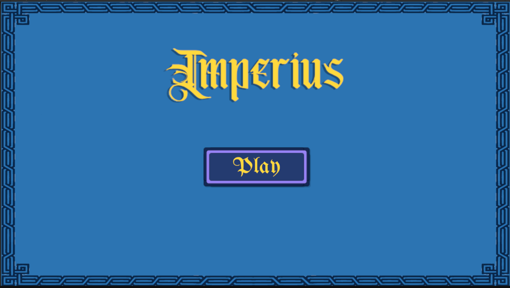
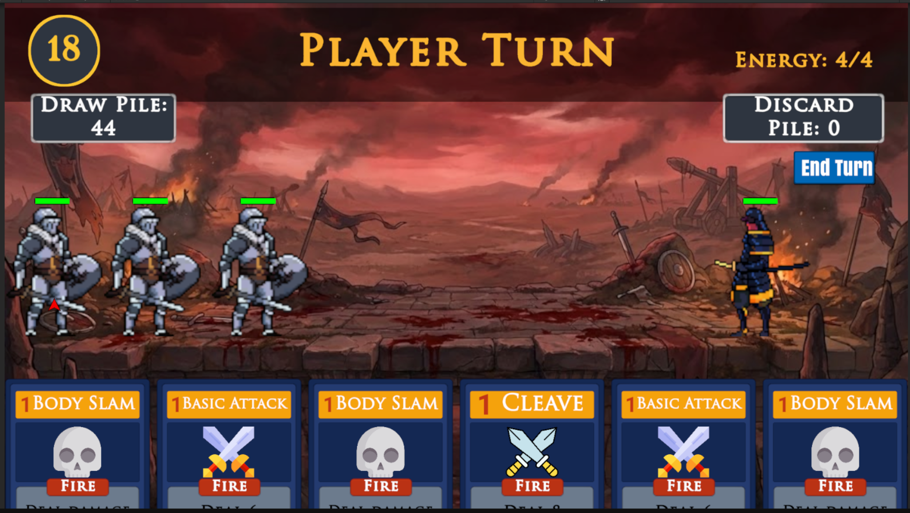
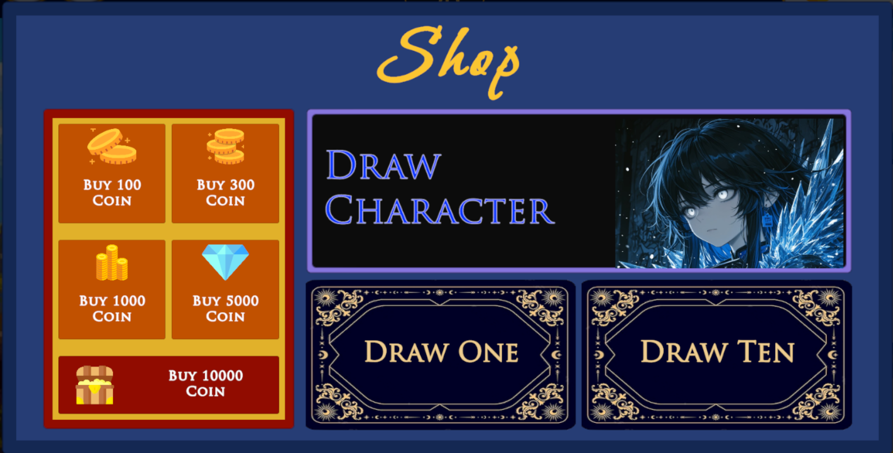

  

  <em>Destiny Awaits</em>

  
  
  
  

---

##  What is Imperius?

**Imperius** is a multiplayer trading card game set in a realm of might and magic — where heroes clash, strategies collide, and only the strongest survive.

Build your team of champions, master card-based synergies, and fight alongside your allies in fast-paced turn-based battles. A dark scourge is spreading across the land. Kingdoms have fallen. The old order is gone.

You are what remains.

Assemble your roster, draw your hand, and march into battle — glory awaits those bold enough to claim it.

### Current Champions

| Champion | Title |
|---|---|
| ⚔️ Paladin | *Aldric the Unyielding* |
| 🔮 Mage | *Seraphel of the Veil* |
| 🗡️ Mercenary | *Cain Duskblade* |
| 🏹 Ranger | *Veyra Swiftarrow* |
| 🧿 Witch | *Morryn the Hollowed* |

  <em>more to follow</em>

## Screenshots

  <em>here is a preview of some of the game scenes</em>

### Title Screen

  

### Gameplay

  

### Shop

  

---

##  Inspiration

We loved the depth of Slay the Spire and the accessibility of Super Auto Pets, but felt neither captured true team-based coordination. Imperius is our answer to that gap.

---

##  Game World

 A once-prosperous realm now consumed by a creeping darkness. Ancient champions stir from their rest. Only a team of unlikely heroes stands between the scourge and total oblivion.

---

## Features

-  **Card Collection & Deck Building** — Collect, manage, and craft powerful decks with deep strategic flexibility
-  **Turn-Based Team Battles** — Fight in skill-driven PVP matches that reward coordination and strategy
-  **Gacha Summoning System** — Draw new cards with rarity tiers, pity mechanics, and free daily pulls
-  **Multiplayer & Team Mechanics** — Coordinate with allies in team-based combat unique to the genre
-  **Leaderboards & Rankings** — Compete globally and climb the ranks each season
-  **Daily Rewards & Missions** — Log in every day for rewards that keep the grind fresh
-  **In-App Currency & Shop** — Spend gems on card packs, skins, and exclusive abilities
-  **Account System** — Secure login, cloud saves, and cross-session progression via Firebase

---

## Dev Roadmap

| Status | Milestone |
|:---:|---|
| ✅ | Core gameplay loop |
| ✅ | Shop system |
| ✅  | Leaderboards & ranking system |
| ✅ | Daily rewards & missions |
| ✅ | User authentication (Firebase) |
| 🔄 | Gacha / summoning system |
| 🔄 | Turn-based battle system |
| 📋 | Additional champions & abilities |
| 📋 | Audio & SFX pass |
| 📋 | Story Mode |

> ✅ Done &nbsp;&nbsp; 🔄 In Progress &nbsp;&nbsp; 📋 Planned

---

##  Built With

- **Unity** — Game engine
- **C#** — Scripting
- **Firebase** — Authentication, cloud saves & multiplayer backend
- **Android SDK** — Target platform

---
